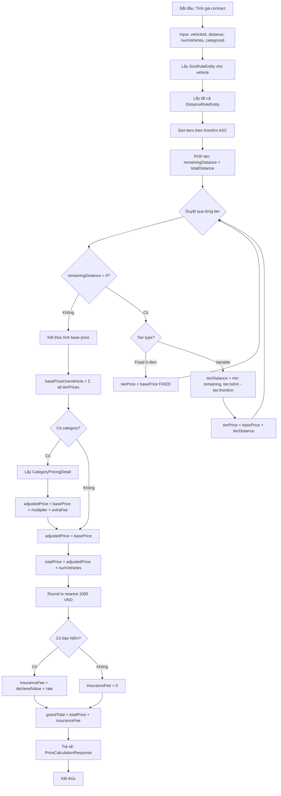
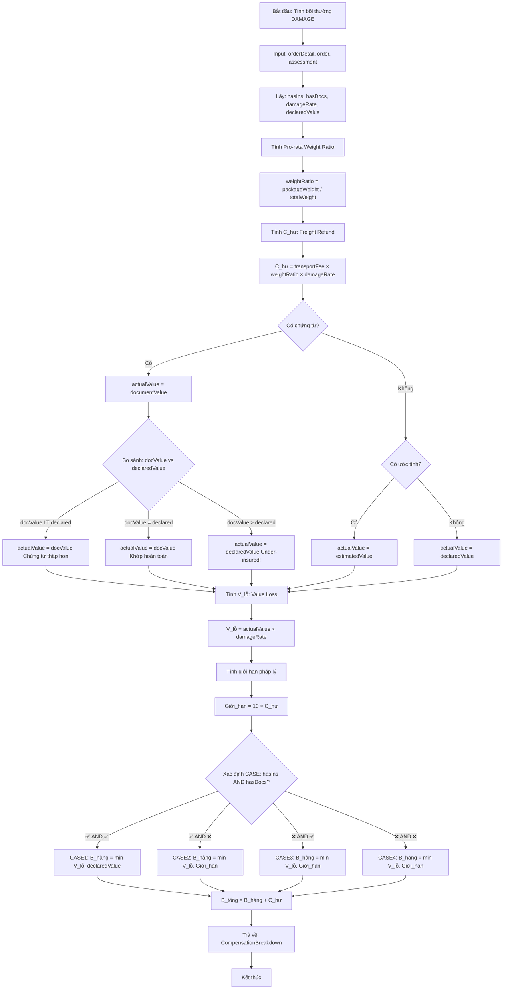

# 💰 Chi tiết Flowcharts: Pricing & Compensation

## 🎯 Contract Pricing Algorithm

### Formula tổng quan
```
Step 1: Base Price (1 vehicle) = Σ tier_prices
Step 2: Adjusted Price = Base × multiplier + extraFee  
Step 3: Total Price = Adjusted × numVehicles
Step 4: Round to nearest 1000 VND
Step 5: Grand Total = Total + Insurance Fee
```

### Mermaid Flowchart



### Ví dụ cụ thể

#### Input
```
- Vehicle: Xe 5 tấn
- Distance: 45 km
- Number of Vehicles: 3
- Category: FRAGILE (multiplier=1.5, extraFee=50,000)
- Insurance: Yes (declaredValue=100M, rate=0.5%)
```

#### Calculation Steps

**Step 1: Base Price for 1 Vehicle**
```
Distance Tiers:
├─ Tier 1 (0-4 km, FIXED):     150,000 VND
├─ Tier 2 (4-10 km, 6 km):     6 × 18,000 = 108,000 VND
├─ Tier 3 (10-30 km, 20 km):   20 × 15,000 = 300,000 VND
└─ Tier 4 (>30 km, 15 km):     15 × 12,000 = 180,000 VND
   ────────────────────────────────────────────
   Base Price: 738,000 VND
```

**Step 2: Category Adjustment**
```
Formula: adjusted = base × multiplier + extraFee
Calculation: 738,000 × 1.5 + 50,000 = 1,157,000 VND
```

**Step 3: Multiply by Vehicles**
```
Formula: total = adjusted × numVehicles
Calculation: 1,157,000 × 3 = 3,471,000 VND
```

**Step 4: Round to 1000**
```
Before: 3,471,000 VND
After:  3,471,000 VND (already rounded)
```

**Step 5: Add Insurance**
```
Formula: insurance = declaredValue × rate
Calculation: 100,000,000 × 0.005 = 500,000 VND

Grand Total: 3,471,000 + 500,000 = 3,971,000 VND
```

---

## 🛡️ Compensation Calculation Algorithm

### Formula cho DAMAGE Issues
```
Step 1: C_hư = C_total × (W_kiện / W_total) × T_hư
Step 2: V_lỗ = V_thực_tế × T_hư
Step 3: Giới_hạn = 10 × C_hư
Step 4: B_hàng = Depends on 4 cases (insurance × documents)
Step 5: B_tổng = B_hàng + C_hư
```

### Decision Matrix cho B_hàng

| Insurance | Documents | Formula | Note |
|-----------|-----------|---------|------|
| ✅ | ✅ | `min(V_lỗ, V_khai_báo)` | CASE1: No 10× limit |
| ✅ | ❌ | `min(V_lỗ, 10×C_hư)` | CASE2: Insurance VOID |
| ❌ | ✅ | `min(V_lỗ, 10×C_hư)` | CASE3: Legal limit |
| ❌ | ❌ | `min(V_lỗ, 10×C_hư)` | CASE4: Legal limit |

### Mermaid Flowchart



### Ví dụ cụ thể

#### Scenario 1: CASE1 (Insurance + Documents)

**Input:**
```
- Transport Fee: 3,000,000 VND
- Package Weight: 2 tấn
- Total Order Weight: 10 tấn
- Damage Rate: 50%
- Declared Value: 80,000,000 VND
- Document Value: 100,000,000 VND (higher!)
- Has Insurance: YES
- Has Documents: YES
```

**Calculation:**
```
Step 1: Freight Refund
C_hư = 3,000,000 × (2/10) × 0.5 = 300,000 VND

Step 2: Actual Value
Document (100M) > Declared (80M) → Under-insured!
actualValue = 80,000,000 VND (max = declared)

Step 3: Value Loss
V_lỗ = 80,000,000 × 0.5 = 40,000,000 VND

Step 4: Legal Limit
Giới_hạn = 300,000 × 10 = 3,000,000 VND

Step 5: Goods Compensation (CASE1)
B_hàng = min(40,000,000, 80,000,000) = 40,000,000 VND
(CASE1 không áp dụng giới hạn 10×!)

Step 6: Total
B_tổng = 40,000,000 + 300,000 = 40,300,000 VND
```

**Explanation:**
```
"Có BH + Có CT: CT > KB (100M > 80M) - Đền tối đa theo KB (Under-insured).
Bồi thường theo giá trị thực tế, không giới hạn 10×."
```

#### Scenario 2: CASE2 (Insurance but NO Documents)

**Input:**
```
- Same as above but Has Documents: NO
```

**Calculation:**
```
Step 1-4: Same (C_hư=300k, V_lỗ=40M, Giới_hạn=3M)

Step 5: Goods Compensation (CASE2)
B_hàng = min(40,000,000, 3,000,000) = 3,000,000 VND
(CASE2 bảo hiểm vô hiệu → áp dụng giới hạn 10×!)

Step 6: Total
B_tổng = 3,000,000 + 300,000 = 3,300,000 VND
```

**Explanation:**
```
"Có BH nhưng KHÔNG có CT: Bảo hiểm vô hiệu, 
áp dụng giới hạn 10× C_hư (3,000,000 VND)"
```

**Chênh lệch:** 40.3M vs 3.3M = **37M VND difference!**  
→ Chứng từ CỰC KỲ quan trọng!

---

## 📊 So sánh 4 Cases

### Cùng điều kiện: V_lỗ = 40M, C_hư = 300k, Giới_hạn = 3M

| Case | Insurance | Documents | B_hàng | B_tổng | Note |
|------|-----------|-----------|--------|--------|------|
| CASE1 | ✅ | ✅ | 40,000,000 | 40,300,000 | ✅ Tốt nhất |
| CASE2 | ✅ | ❌ | 3,000,000 | 3,300,000 | ⚠️ Ins void |
| CASE3 | ❌ | ✅ | 3,000,000 | 3,300,000 | ⚠️ Legal limit |
| CASE4 | ❌ | ❌ | 3,000,000 | 3,300,000 | ⚠️ Minimal |

**Key Takeaway:**
- ✅ Insurance + Documents = FULL coverage (40.3M)
- ❌ Missing either one = Only 10× limit (3.3M)
- **Difference: 37M VND (12x)** 🚨

---

## 🎓 Lessons Learned

### Pricing Algorithm
- ✅ Tier-based progressive pricing
- ✅ Category multiplier + extra fee
- ✅ Insurance separate from transport
- ✅ Rounding to 1000 VND for professional look

### Compensation Algorithm
- ✅ 4-case matrix handles all scenarios
- ✅ Pro-rata refund (fair weight-based)
- ✅ Document comparison prevents fraud
- ✅ Under-insurance protection
- ✅ 10× legal limit for non-insured

**Both algorithms are PRODUCTION-READY!** ✅
